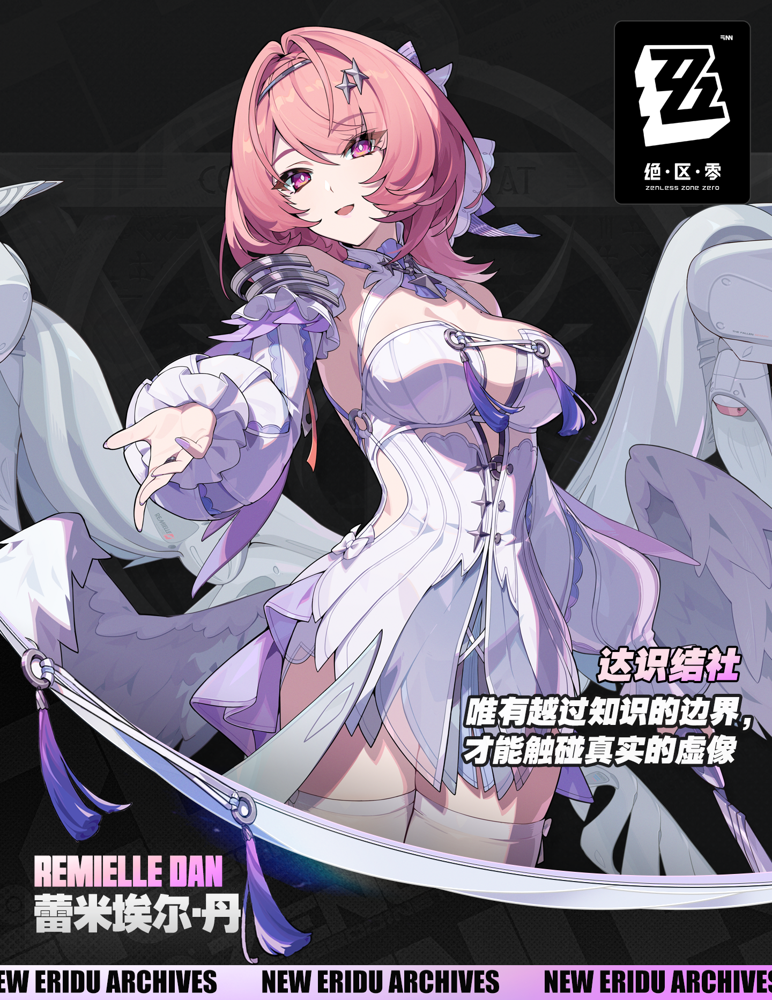

<div align="center">

<p>

&nbsp;&nbsp;&nbsp;

</p>

# ✦ Remielle Chibi Desktop Mascot ✦

### **Character Asset Pack & Multi-Platform Desktop Mascot Framework**

**Q 版蕾米埃尔桌宠 — 角色数字资产 & 多平台桌宠框架**

<p>
  
  
  
  
</p>

<p>
  
  
  
  
</p>

<p>
  <b>English</b> · <a href="#关于蕾米埃尔">中文</a>
</p>

</div>

---

> [!WARNING]
> **Fan-made derivative assets.** Remielle and all related intellectual property belong to **HoYoverse / miHoYo**.
> This project is intended for **personal and educational use only**.
> See [`ASSET_LICENSE.md`](ASSET_LICENSE.md) for full asset usage terms.


---

<details>
<summary><h3>✨ Preview — Animation Showcase</h3></summary>

<details>
<summary><b>GROUP A</b></summary>
<table>
<tr>
<td></td>
<td><b>Idle 待机</b><br>安静地端详着画本</td>
<td></td>
<td><b>Thinking 思考</b><br>右手拿画笔，左手托下巴：「画什么好呢？」</td>
</tr>
<tr>
<td></td>
<td><b>Drawing 作画</b><br>全速运转！手持画笔疯狂作画中</td>

<td></td>
<td><b>Finished 完成</b><br>从疯狂画画状态自然过渡到收笔，回归待机</td>
</tr>
</table>
</details>


<details>
<summary><b>GROUP B</b></summary>
<table>
<tr>
<td></td>
<td><b>Appreciation 欣赏</b><br>沾沾自喜欣赏自己的得意作品。</td>
<td></td>
<td><b>ActingCute 卖萌</b><br>卖萌或是恳求的表情 🥺</td>
</tr>
<tr>
<td></td>
<td><b>Ready 准备</b><br>在待机基础上拿出了画笔，蓄势待发</td>
<td></td>
<td><b>Golden Light 金色光芒</b><br>神作诞生 —— 哇~金色传说！</td>
</tr>
</table>
</details>


</details>

---

## 🎭 About Remielle | 关于蕾米埃尔

> [!TIP]
> ✦ 祝各位绳匠十连十金，限定不歪，心仪代理人顺利来到身边！
>
> ✦ Good luck, Proxies! May your pulls be golden and your favorite Agents come home!

<table>
<tr valign="top">
<td width="200"></td>
<td>

<table>
<tr><th>Property</th><th>Detail</th></tr>
<tr><td><b>Agent Name</b></td><td>Remielle Dan (蕾米埃尔·丹)</td></tr>
<tr><td><b>Rank</b></td><td><span style="color:#ff69b4">★ S-Rank Limited ★</span></td></tr>
<tr><td><b>Faction</b></td><td>Void Hunters (虚狩)</td></tr>
<tr><td><b>Attribute</b></td><td>Lumiflux (流明)</td></tr>
<tr><td><b>Debut</b></td><td>ZZZ Version 3.1</td></tr>
</table>

</td>
</tr>
</table>

Remielle Dan is an S-Rank Agent introduced in Zenless Zone Zero Version 3.1. As a founding member of the first-generation **Void Hunters**, she wields the **Lumiflux** attribute with angelic wings and a gentle yet determined personality.

蕾米埃尔是《绝区零》3.1 版本**流明**属性限定 S 级代理人，初代 **虚狩 (Void Hunter)** 核心成员， 拥有美丽动人的面容 ~大雷~ 、强大的战斗力和天使般的翅膀。

---

## 🚀 Quick Start

<details>
<summary><b>📌 Prerequisites</b></summary>

- **Node.js** >= 18.x
- **npm** >= 9.x

</details>

<details open>
<summary><b>🔧 Installation & Run</b></summary>

```bash
# 1. Clone the repository
git clone https://github.com/AonoChano/Remielle_Chibi-Desktop-Mascot.git
cd Remielle_Chibi-Desktop-Mascot

# 2. Install Electron dependencies
cd mascots/electron
npm install

# 3. Spine assets are already included in mascots/electron/assets/
#    If needed, re-export from the original .spine project via Spine Editor

# 4. Launch!
npm start
```

</details>

<details>
<summary><b>📦 Spine Assets</b></summary>

Spine runtime assets are located in `mascots/electron/assets/`:

- `remi.json` — Skeleton JSON
- `leimi.png` — Texture image
- `leimi.atlas` — Texture atlas descriptor

All files are included in the repository. To modify, re-export from the original `.spine` project via **Spine Editor**.

</details>

---

## 📐 Features

<details>
<summary><b>骨骼动画 Spine Animations</b></summary>

| Feature | Detail |
|:--------|:-------|
| Animations | 9 (idle, victory, talking, thinking, drawing, crying, light effects, etc.) |
| Bones | 257 |
| Slots | 199 |
| IK Constraints | 6 |
| Physics Constraints | 80 (hair, ribbon, wing, cloth physics) |
| Outfit Skins | 5 (A through E) |
| Head Tracking | Pseudo-3D constraint-driven head follow |

</details>

<details>
<summary><b>桌宠应用 Desktop Pet</b></summary>

- **Transparent always-on-top window** — 透明置顶悬浮窗
- **Drag to reposition** — 支持鼠标拖拽移动
- **System tray integration** — 系统托盘图标，右键菜单
- **Control Panel** — 侧边栏控制面板，实时切换动画和换装
- **Multi-platform builds** — Windows (NSIS), macOS (DMG), Linux (AppImage)

</details>

<details>
<summary><b>可扩展框架 Extensible Framework</b></summary>

| Platform | Directory | Status |
|:---------|:----------|:-------|
|  | `mascots/electron/` | ✅ Working |
|  | `mascots/dsh-web/` | ✅ Working |
|  | `mascots/bongo-cat/` | 📋 Planned |
|  | `mascots/codex-cli-pet/` | 📋 Planned |
|  | `mascots/claude-code-pet/` | 📋 Planned |
|  | `mascots/web/` | 📋 Planned *(通用可嵌入 Web 组件)* |
|  | `mascots/wallpaper-engine/` | 📋 Planned |
|  | `mascots/unity/` | 📋 Planned |

> [!NOTE]
> `mascots/dsh-web/` 是 **DeepSeek Harness 网页（`dsh web`）专用桌宠插件**（双面 Cordis 插件包，接入方式见其 `README.md`）；`mascots/web/` 仍是计划中的**通用可嵌入 Web 组件**，两者定位不同。

</details>

---

## 📁 Directory Structure

```
Remielle_Chibi-Desktop-Mascot/
├── .gitignore
├── README.md                    ← You are here
├── ASSET_LICENSE.md             ← Assets Copyright
├── LICENSE                      ← MIT License
│
├── docs/
│   ├── getting-started.md       ← Electron quick start guide
│   └── spine-animation-guide.md ← Spine asset documentation
│
├── spine/
│   └── remeille-chibi/
│       └── remeille-chibi.atlas ← Texture atlas (reference copy)
│
├── assets/                      ← README showcase assets
│   ├── remi_drawing.gif        ← Animation preview GIF
│   ├── BannerLogo.png          ← Project banner logo
│   └── leimi.png               ← Clean chibi portrait (logo source)
│
└── mascots/
    ├── electron/                  ← Electron desktop pet (working)
    │   ├── package.json
    │   ├── main.js               ← Electron main process (tray + windows)
    │   ├── preload.js            ← Context bridge
    │   ├── pet.html / pet.js     ← Transparent pet renderer + Spine engine
    │   ├── panel.html / panel.css / panel.js ← Control panel
    │   ├── assets/
    │   │   ├── remi.json        ← Skeleton JSON
    │   │   ├── leimi.atlas      ← Texture atlas descriptor
    │   │   ├── leimi.png        ← Texture image
    │   │   └── logo.png         ← Clean portrait for tray/panel icon
    │
    ├── dsh-web/                   ← DeepSeek Harness 网页桌宠插件 (working)
    │   ├── package.json          ← 双面 Cordis 插件清单 (dsh.client + exports["./client"])
    │   ├── build.mjs             ← rollup 打包浏览器半区 bundle
    │   ├── lib/index.js          ← Node 半区：/remi-pet 资产路由
    │   ├── assets/               ← remi.json / leimi.atlas / leimi.png
    │   ├── src/client/           ← 浏览器半区：PetView / behavior / spine 引擎
    │   └── test/                 ← 行为状态机 + bundle 契约测试
    │
    ├── bongo-cat/                ← Bongo Cat integration (planned)
    ├── codex-cli-pet/            ← Codex CLI pet hook (planned)
    ├── claude-code-pet/          ← Claude Code pet hook (planned)
    ├── web/                      ← 通用可嵌入 Web 组件 (planned)
    ├── wallpaper-engine/         ← Wallpaper Engine (planned)
    └── unity/                    ← Unity runtime (planned)
```

---

## 🔨 Building for Distribution

> [!NOTE]
> Build scripts (`build:win`, `build:mac`, `build:linux`) are not yet configured.
> To create distributable packages, integrate [electron-builder](https://www.electron.build/) into `package.json`.

```bash
cd mascots/electron

# Example with electron-builder (after setup):
npx electron-builder --win    # NSIS installer + portable
npx electron-builder --mac    # DMG
npx electron-builder --linux  # AppImage
```

See [`docs/getting-started.md`](docs/getting-started.md) for detailed instructions.

---


## 📜 License

The source code of this project is licensed under the MIT License.

Character assets, illustrations, and related materials are not covered by this license.
They remain the property of their respective copyright holders.


本项目采用 **MIT 许可证**。角色设计和原始美术素材，以及任何其他相关素材，版权均归米哈游 / miHoYo / HoYoverse 所有，仅供**个人和教育用途**。

---

## 🔍 Acknowledgments / Copyright

- **miHoYo / HoYoverse** — Original character design and Zenless Zone Zero, assets copyright owned.
- **EsotericSoftware** — [Spine 2D Animation Runtime](https://esotericsoftware.com)
- **Electron** — Cross-platform desktop application framework
- **Bongo Cat** — Desktop pet framework inspiration

---

<div align="center">

<b>Made with 🎨 and ❤️ by </b> [<b>AonoChano</b>](https://github.com/AonoChano)

<i>"What a shame, here's where today's little Q&A game ends~"</i>

</div>
