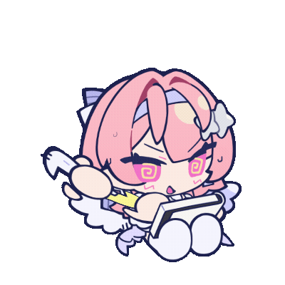
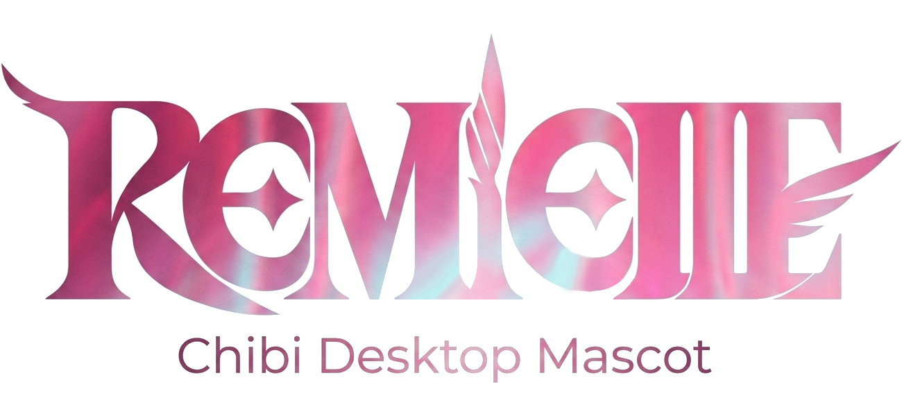
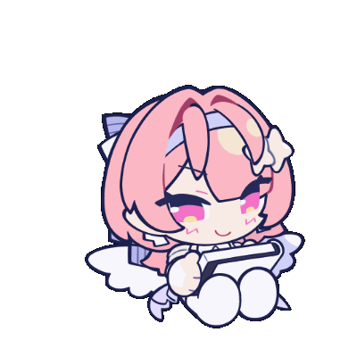
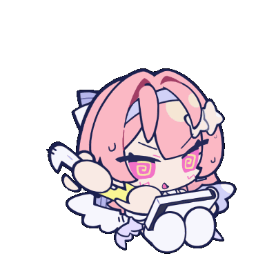
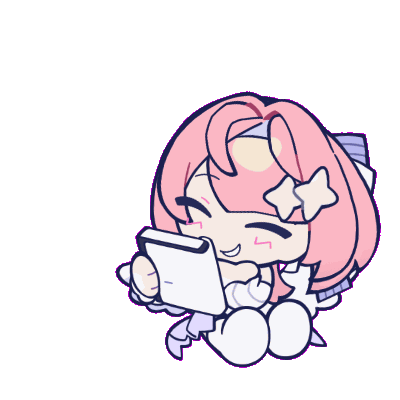
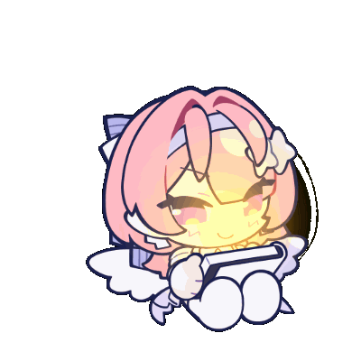

<div align="center">

<p>

&nbsp;&nbsp;&nbsp;

</p>

# ✦ Remielle Chibi Desktop Mascot ✦

### **Character Asset Pack & Multi-Platform Desktop Mascot Framework**

**Q 版蕾米埃尔桌宠 — 角色数字资产 & 多平台桌宠框架**

<p>
  
  
  
  
</p>

<p>
  
  
  
  
</p>

<p>
  <b>English</b> · <a href="#关于蕾米埃尔">中文</a>
</p>

</div>

---

> [!WARNING]
> **Fan-made derivative assets.** Remielle and all related intellectual property belong to **HoYoverse / miHoYo**.
> This project is intended for **personal and educational use only**.
> See [`ASSET_LICENSE.md`](ASSET_LICENSE.md) for full asset usage terms.

---

<details>
<summary><b>✨ Preview — Animation Showcase</b></summary>

<details>
<summary>待机 Idle & 思考 Thinking</summary>
<table>
<tr>
<td></td>
<td>盯着画本看，安静地端详着即将创作的画作</td>
<td></td>
<td>右手拿画笔，左手托下巴：「画什么好呢？」</td>
</tr>
</table>
</details>

<details>
<summary>疯狂画画 Drawing & 画完炫耀 Finished</summary>
<table>
<tr>
<td></td>
<td>全速运转！手持画笔疯狂作画中</td>
<td></td>
<td>扭头向左，比出 V 字手势：「天才画家就是我」</td>
</tr>
</table>
</details>

<details>
<summary>画完收笔 Done & 委屈 Tearing Up</summary>
<table>
<tr>
<td></td>
<td>从疯狂画画状态自然过渡到收笔，回归待机</td>
<td></td>
<td>眼泪哗哗流，八字眉三角嘴，好像受了天大委屈</td>
</tr>
</table>
</details>

<details>
<summary>拿起画笔 Ready & 金色光芒 Golden Light</summary>
<table>
<tr>
<td></td>
<td>在待机基础上拿出了画笔，蓄势待发</td>
<td></td>
<td>画本发出耀眼的金色光芒——旷世神作诞生！</td>
</tr>
</table>
</details>

</details>

---

## 🎭 About Remielle | 关于蕾米埃尔

<div align="center">

| Property | Detail |
|:---------|:-------|
| **Agent Name** | Remielle Dan (蕾米埃尔·丹) |
| **Rank** | <span style="color:#ff69b4">★ S-Rank Limited ★</span> |
| **Faction** | Void Hunters (虚狩) |
| **Attribute** | Lumiflux (流明) |
| **Debut** | ZZZ Version 3.1 |

</div>

Remielle Dan is an S-Rank Agent introduced in Zenless Zone Zero Version 3.1. As a founding member of the first-generation **Void Hunters**, she wields the **Lumiflux** attribute with angelic wings and a gentle yet determined personality.

蕾米埃尔是《绝区零》3.1 版本**流明**属性限定 S 级代理人，初代 **虚狩 (Void Hunter)** 核心成员，拥有美丽动人的面容、强大的战斗力和天使般的翅膀。在桌宠中她化身为一位热爱画画的 Q 版小画家！

---

## 🚀 Quick Start

<details>
<summary><b>📌 Prerequisites</b></summary>

- **Node.js** >= 18.x
- **npm** >= 9.x

</details>

<details open>
<summary><b>🔧 Installation & Run</b></summary>

```bash
# 1. Clone the repository
git clone https://github.com/AonoChano/Remielle_Chibi-Desktop-Mascot.git
cd Remielle_Chibi-Desktop-Mascot

# 2. Install Electron dependencies
cd mascots/electron
npm install

# 3. Spine assets are already included in mascots/electron/assets/
#    If needed, re-export from the original .spine project via Spine Editor

# 4. Launch!
npm start
```

</details>

<details>
<summary><b>📦 Spine Assets</b></summary>

Spine runtime assets are located in `mascots/electron/assets/`:

- `remi.json` — Skeleton JSON
- `leimi.png` — Texture image
- `leimi.atlas` — Texture atlas descriptor

All files are included in the repository. To modify, re-export from the original `.spine` project via **Spine Editor**.

</details>

---

## 📐 Features

<details>
<summary><b>骨骼动画 Spine Animations</b></summary>

| Feature | Detail |
|:--------|:-------|
| Animations | 9 (idle, victory, talking, thinking, drawing, crying, light effects, etc.) |
| Bones | 257 |
| Slots | 199 |
| IK Constraints | 6 |
| Physics Constraints | 80 (hair, ribbon, wing, cloth physics) |
| Outfit Skins | 5 (A through E) |
| Head Tracking | Pseudo-3D constraint-driven head follow |

</details>

<details>
<summary><b>桌宠应用 Desktop Pet</b></summary>

- **Transparent always-on-top window** — 透明置顶悬浮窗
- **Drag to reposition** — 支持鼠标拖拽移动
- **System tray integration** — 系统托盘图标，右键菜单
- **Control Panel** — 侧边栏控制面板，实时切换动画和换装
- **Multi-platform builds** — Windows (NSIS), macOS (DMG), Linux (AppImage)

</details>

<details>
<summary><b>可扩展框架 Extensible Framework</b></summary>

| Platform | Directory | Status |
|:---------|:----------|:-------|
|  | `mascots/electron/` | ✅ Working |
|  | `mascots/bongo-cat/` | 📋 Planned |
|  | `mascots/codex-cli-pet/` | 📋 Planned |
|  | `mascots/claude-code-pet/` | 📋 Planned |
|  | `mascots/web/` | 📋 Planned |
|  | `mascots/wallpaper-engine/` | 📋 Planned |
|  | `mascots/unity/` | 📋 Planned |

</details>

---

## 📁 Directory Structure

```
Remielle_Chibi-Desktop-Mascot/
├── .gitignore
├── README.md                    ← You are here
├── ASSET_LICENSE.md             ← Assets Copyright
├── LICENSE                      ← MIT License
│
├── docs/
│   ├── getting-started.md       ← Electron quick start guide
│   └── spine-animation-guide.md ← Spine asset documentation
│
├── spine/
│   └── remeille-chibi/
│       └── remeille-chibi.atlas ← Texture atlas (reference copy)
│
├── assets/                      ← README showcase assets
│   ├── remi_drawing.gif        ← Animation preview GIF
│   ├── BannerLogo.png          ← Project banner logo
│   └── leimi.png               ← Clean chibi portrait (logo source)
│
└── mascots/
    ├── electron/                  ← Electron desktop pet (working)
    │   ├── package.json
    │   ├── main.js               ← Electron main process (tray + windows)
    │   ├── preload.js            ← Context bridge
    │   ├── pet.html / pet.js     ← Transparent pet renderer + Spine engine
    │   ├── panel.html / panel.css / panel.js ← Control panel
    │   ├── assets/
    │   │   ├── remi.json        ← Skeleton JSON
    │   │   ├── leimi.atlas      ← Texture atlas descriptor
    │   │   ├── leimi.png        ← Texture image
    │   │   └── logo.png         ← Clean portrait for tray/panel icon
    │
    ├── bongo-cat/                ← Bongo Cat integration (planned)
    ├── codex-cli-pet/            ← Codex CLI pet hook (planned)
    ├── claude-code-pet/          ← Claude Code pet hook (planned)
    ├── web/                      ← Web component (planned)
    ├── wallpaper-engine/         ← Wallpaper Engine (planned)
    └── unity/                    ← Unity runtime (planned)
```

---

## 🔨 Building for Distribution

> [!NOTE]
> Build scripts (`build:win`, `build:mac`, `build:linux`) are not yet configured.
> To create distributable packages, integrate [electron-builder](https://www.electron.build/) into `package.json`.

```bash
cd mascots/electron

# Example with electron-builder (after setup):
npx electron-builder --win    # NSIS installer + portable
npx electron-builder --mac    # DMG
npx electron-builder --linux  # AppImage
```

See [`docs/getting-started.md`](docs/getting-started.md) for detailed instructions.

---

## 🎮 Animation Controls

<details>
<summary><b>Keyboard Shortcuts (Electron)</b></summary>

| Shortcut | Action |
|:---------|:-------|
| `1` | Idle (a) — 待机 |
| `2` | Victory (a_win) — 胜利 |
| `3` | Thinking (b) — 思考 |
| `4` | Finished (c) — 画完炫耀 |
| `5` | Drawing (d) — 疯狂画画 |
| `6` | Done (d_win) — 画完收笔 |
| `7` | Tearing Up (e) — 委屈 |
| `8` | Golden Light (light) — 金色光芒 |

Outfit switch: `Q` / `W` / `E` / `R` / `T` for skins A through E.

</details>

---

## 📜 License

This project is licensed under the **MIT License**.

Character design and original art are property of **miHoYo / HoYoverse**. These assets are intended for **personal and educational use only**. Please respect the original intellectual property rights.

本项目采用 **MIT 许可证**。角色设计和原始美术素材归米哈游 / HoYoverse 所有，仅供**个人和教育用途**。

---

## 🔍 Acknowledgments

- **miHoYo / HoYoverse** — Original character design and Zenless Zone Zero
- **EsotericSoftware** — [Spine 2D Animation Runtime](https://esotericsoftware.com)
- **Electron** — Cross-platform desktop application framework
- **Bongo Cat** — Desktop pet framework inspiration

---

<div align="center">

<b>Made with 🎨 and ❤️ by </b> [<b>AonoChano</b>](https://github.com/AonoChano)

<i>"What a shame, here's where today's little Q&A game ends~"</i>

</div>
